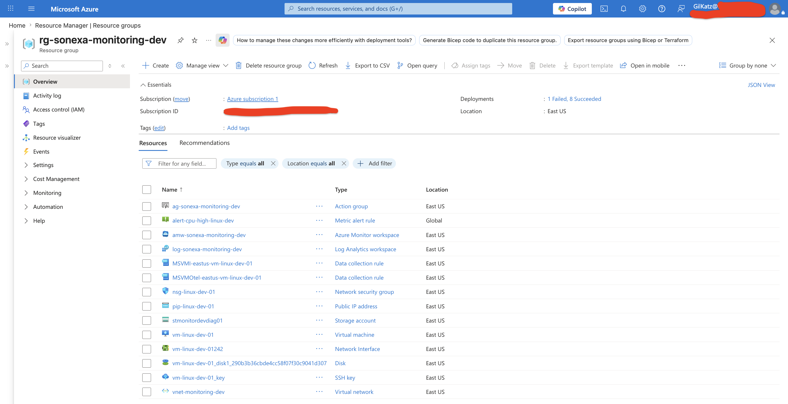
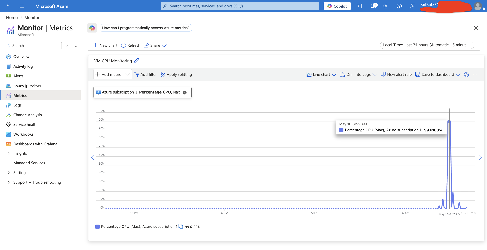
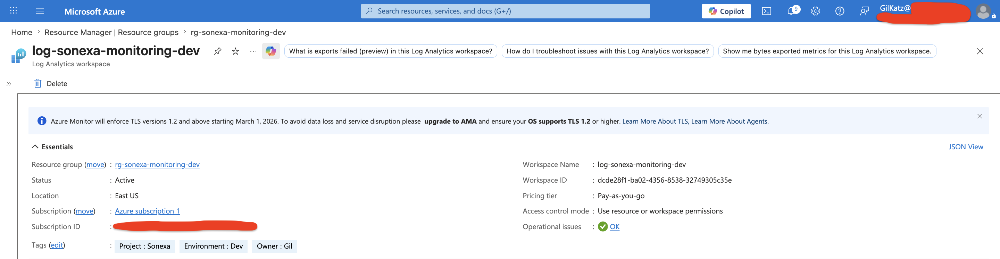
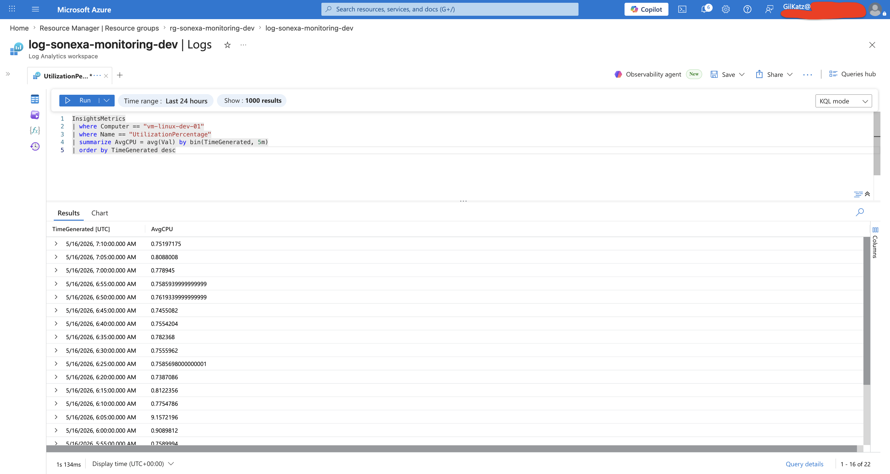
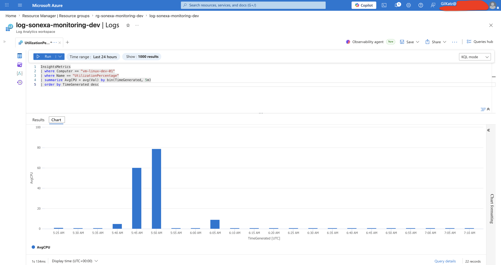
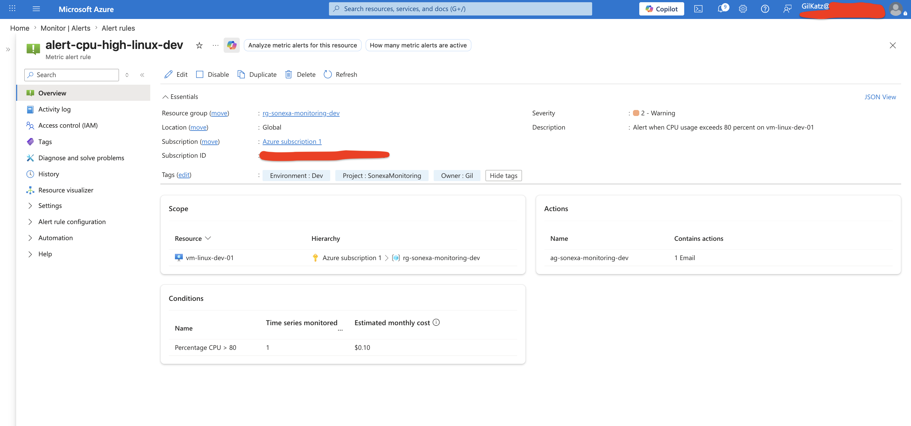
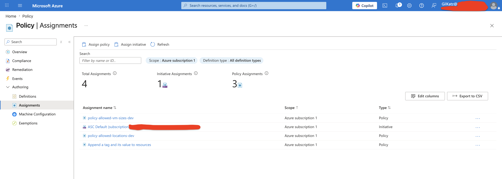
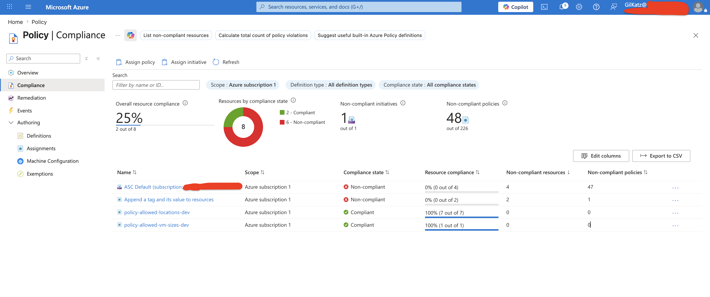
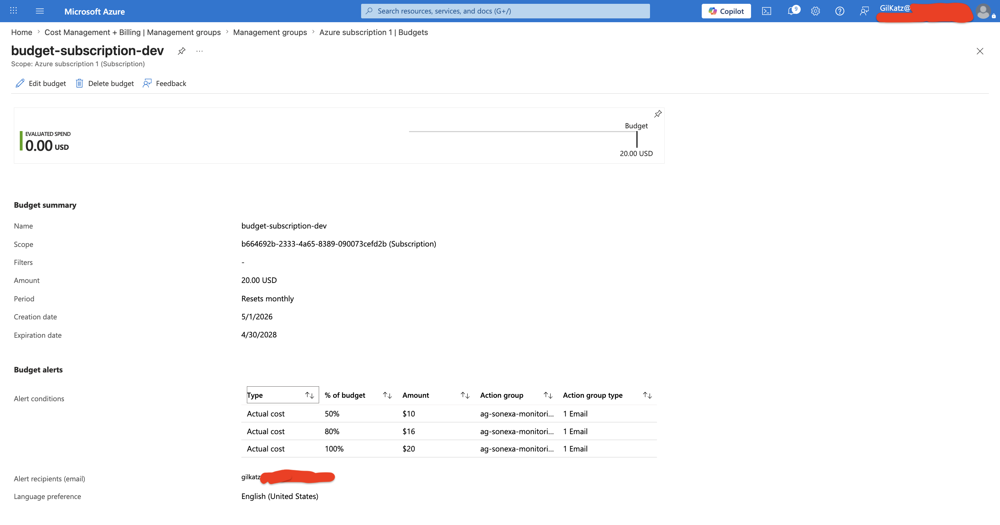

# Azure Monitoring & Governance System

## Overview
This project demonstrates enterprise-style Azure monitoring, governance, alerting, and cost management using native Azure services.

The environment was designed to simulate real-world cloud operations responsibilities aligned with Microsoft AZ-104 administration concepts.

The project includes:
- Azure Monitor
- Log Analytics Workspace
- KQL queries
- Azure Monitor alerts
- Azure Policy governance
- Cost Management budgets and alerts
- Compliance and operational monitoring

# Architecture Overview

## Core Services Used

| Service | Purpose |
|---|---|
| Azure Monitor | Infrastructure monitoring |
| Log Analytics Workspace | Centralized log collection and analysis |
| Azure Policy | Governance and compliance enforcement |
| Azure Alerts | Operational monitoring |
| Cost Management | Budget tracking and financial governance |

# Resource Group Overview

The monitoring and governance environment was organized using Azure Resource Groups to logically separate infrastructure components and management boundaries.

## Screenshot — Resource Group Overview


# Monitoring Configuration

Azure Monitor was enabled to collect infrastructure telemetry and operational metrics from Azure resources.

Monitoring capabilities included:
- Performance metrics
- Activity logs
- Resource health monitoring
- Operational visibility

## Screenshot — Azure Monitor CPU Metrics


# Log Analytics Workspace

A Log Analytics Workspace was configured to centralize monitoring logs and enable KQL-based operational analysis.

## Example KQL Queries

### Heartbeat Query

```kusto
Heartbeat
| sort by TimeGenerated desc
```

### CPU Performance Query

```kusto
InsightsMetrics
| where Computer == "vm-linux-dev-01"
| where Name == "UtilizationPercentage"
| summarize AvgCPU = avg(Val) by bin(TimeGenerated, 5m)
| order by TimeGenerated desc
```

## Screenshot — Log Analytics Workspace


## Screenshot — KQL Query Results


## Screenshot — KQL CPU Utilization Chart


# Azure Monitor Alerts

Azure Monitor alert rules were configured to proactively detect operational issues.

## Configured Alert

| Alert | Condition |
|---|---|
| High CPU Usage | CPU Percentage > 80% |

This demonstrates proactive monitoring and operational incident detection.

## Screenshot — Alert Rule Configuration


# Azure Policy Governance

Azure Policy was implemented to enforce governance and standardization across Azure resources.

## Configured Policies

| Policy | Purpose |
|---|---|
| Allowed VM Sizes | Control infrastructure costs and standardize deployments |
| Allowed Locations | Restrict resource deployment to approved Azure regions |
| Append Tags | Automatically apply governance metadata to resources |

Policies were assigned at the subscription scope to simulate enterprise governance controls.

## Screenshot — Policy Assignments


## Screenshot — Policy Compliance


# Cost Management & Budgeting

Azure Cost Management budgets and alerts were configured to proactively monitor cloud spending.

# Governance Tagging Strategy

Resources were tagged using a standardized governance model.

Project | Sonexa 
Environment | Dev 
Owner | Gil

This improves:
- operational organization
- cost tracking
- governance reporting
- resource filtering

## Budget Configuration

| Threshold | Purpose |
|---|---|
| 50% | Early spending warning |
| 80% | High usage warning |
| 100% | Budget exceeded notification |

This demonstrates financial governance and operational cost awareness.

## Screenshot — Budget Configuration & Alerts


# Governance Design Decisions

## Why Restrict VM Sizes?

Restricting VM SKUs helps:
- control cloud costs
- standardize deployments
- prevent oversized infrastructure provisioning

## Why Restrict Azure Regions?

Restricting deployment regions helps:
- maintain compliance
- reduce governance drift
- enforce operational consistency

## Why Use Budget Alerts?

Budget alerts improve:
- cost visibility
- operational awareness
- proactive financial management

## Why Use Azure Monitor Alerts?

Operational alerts allow infrastructure teams to:
- detect incidents quickly
- monitor resource health
- improve operational response time

# Skills Demonstrated

- Azure Governance
- Azure Policy
- Azure Monitor
- Log Analytics
- KQL Queries
- Operational Monitoring
- Cost Management
- Alerting & Notifications
- Cloud Operations
- Infrastructure Governance

# Conclusion

Successfully designed and implemented an Azure monitoring and governance environment focused on operational visibility, compliance enforcement, proactive alerting, and cloud cost management.

This project demonstrates hands-on experience with Azure Monitor, Log Analytics, KQL, Azure Policy, operational alerting, and governance practices commonly used in enterprise cloud environments.